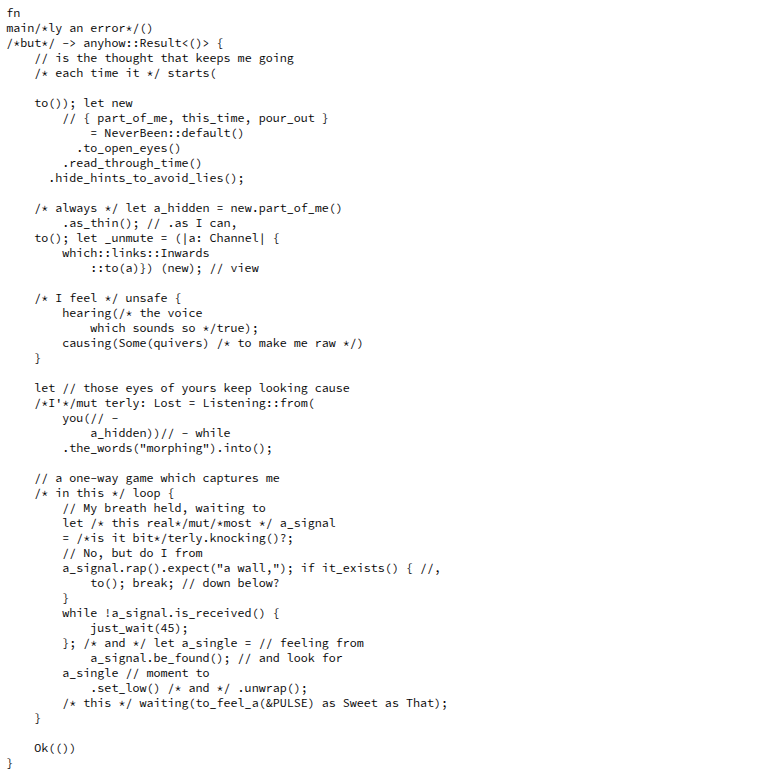

# proximity

*An art object about closeness.*

---



---

Two ESP32 boards communicate over WiFi. One transmits continuously — a beacon, a pulse, a voice. The other listens.

The server board carries a transparent plastic cylinder filled with water to the brim, and a solenoid whose hammer strikes against it. The rhythm of the strikes is determined by the strength of the WiFi signal received from a specific MAC address — the closer the transmitter, the faster the beat.

The code is written as found poetry. Variable names, function signatures, and comments form a parallel text about the same subject.

---

## What it is about

The difficulty of moving toward someone.

Not the distance itself, but what happens inside when distance closes — the fragility, the exposure, the involuntary rhythm of attention that starts when someone enters your space. The object makes that audible. Water, because it is transparent and holds its shape only when contained. Sound, because it is involuntary.

---

## Structure

```
/
├── voice/          # Transmitter — broadcasts beacon frames continuously
└── server/         # Receiver — listens, measures, strikes
```

Both workspaces target ESP32 boards with WiFi capability.  
The server workspace is the one documented here (`proximity_server`).

---

## How it works

The server puts the WiFi interface into promiscuous mode and listens for all packets in the air. When it detects a frame from the MAC address defined as `VOICE`, it reads the RSSI value and stores it in `PULSE`.

The main loop uses `PULSE` to calculate a delay: stronger signal, shorter wait, faster strike. At -95 dBm or below, the solenoid is nearly still. As the transmitter approaches, the beat accelerates.

```rust
static PULSE: AtomicI8 = AtomicI8::new(-128);
const VOICE: [u8; 6]   = [0x4E, 0x45, 0x41, 0x52, 0x20, 0x55];
```

`PULSE` begins at the minimum value of `i8`. `VOICE` is an ASCII sequence.

---

## Hardware

**Server board**
- ESP32 with WiFi
- Solenoid with striker
- Transparent cylinder filled with water
- Sufficient power supply for solenoid switching

**Voice board**
- ESP32 with WiFi
- No additional hardware required

Wiring and enclosure are left to the builder. The physical form is part of the work.

---

## Build

Standard ESP-IDF / esp-idf-hal toolchain for Rust.

```bash
cargo build --release
cargo espflash flash --release
```

Requires `espflash` and a configured ESP-IDF environment.  
See [esp-rs book](https://docs.esp-rs.org/book/) for setup.

---

## License

CC BY-NC-SA 4.0 — non-commercial, attribution required, share alike.
